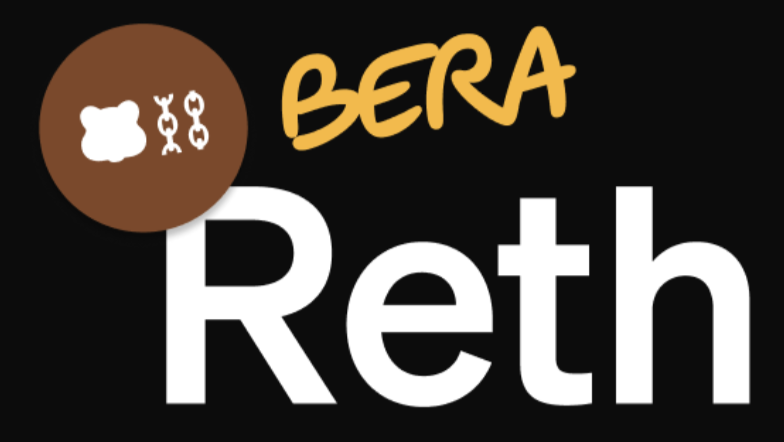

<div align="center">



<p>
  <a href="https://github.com/berachain/bera-reth/actions/workflows/ci.yml">
    
  </a>
  <a href="https://github.com/berachain/bera-reth">
    
  </a>
</p>

</div>

# 🐻⛓️ Bera-Reth: A high-performance Rust Execution Client for Berachain, powered by Reth SDK 🐻⛓️

---

## 🚀 Quickstart

### Prerequisites

- **Rust** (≥ 1.70) with components:
  ```bash
  rustup component add rustfmt clippy
  cargo install cargo-audit cargo-udeps
  ```
- **GNU Make** (optional, for helper make targets)
- **Git**

```bash
git clone https://github.com/berachain/bera-reth.git
cd bera-reth
```

---

## 📦 Building

```bash
# Debug build
cargo build

# Optimized release build
cargo build --release
```

The binary will be at `target/release/bera-reth`.

---

## ▶️ Running Locally with BeaconKit

1. Run `make start` from **your Beacon-Kit repository**. 
2. Save the path to your BeaconKit repository in the `BEACON_KIT` envar, e.g. `export BEACON_KIT=/Users/rezbera/Code/beacon-kit`
3. Run `make start-bera-reth-local` from **this repository**

---

## 🔧 Testing & Quality

We enforce formatting, linting, security, and dead-code checks:

```bash
# 1️⃣ Check formatting
cargo fmt --all -- --check

# 2️⃣ Lint with Clippy (deny all warnings)
cargo clippy --all-targets --all-features -- -D warnings

# 3️⃣ Run tests
cargo test --all --locked --verbose

# 4️⃣ Security audit
cargo audit

# 5️⃣ Detect unused dependencies
cargo udeps --all-features --locked
```

## 📜 License

Licensed under the Apache-2.0 License. See [LICENSE](LICENSE) for details.
