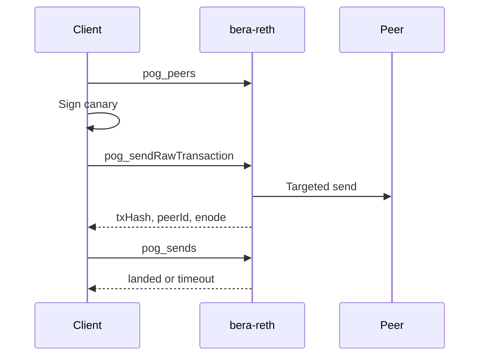

# Proof of Gossip: node surface and client duties

Proof of Gossip on stock `bera-reth` is a send-and-watch API. The node records
that it delivered one signed transaction to one connected peer, then whether that
hash later appeared in a block.

The client (sentry, collector, cron job) holds the signer, nonce ledger, peer
schedule, and durable log.

## What the node presents

Enable with `--bera.pog`. The `pog` JSON-RPC namespace is on IPC only (default
`/tmp/reth.ipc`).

| Method                                  | Role                                                                                            |
| --------------------------------------- | ----------------------------------------------------------------------------------------------- |
| `pog_peers`                             | Live sessions: `peerId`, session `enode://peerId@ip:port`, `direction`, `client`.               |
| `pog_sendRawTransaction(peerId, rawTx)` | Targeted `send_transactions` to that peer.                                                      |
| `pog_penalize(peerId)`                  | Ban that peer through stock Reth reputation.                                                    |
| `pog_sends`                             | RAM window: hash, peer, enode snapshot, `from`, nonce, `sentAt`, `sent` / `landed` / `timeout`. |
| `pog_nodeStatus`                        | `syncing`, head number/hash, inflight count.                                                    |

Credit key is `txHash → peerId`. The session enode is a locator at send time. IP
can change; the 64-byte `peerId` does not. Build `enode` from the established TCP
remote. Discovery-advertised addresses can differ from that remote.

Prometheus on the node is `/24` occupancy and send outcomes:
`pog_peers{subnet,direction}`, `pog_sends_total{subnet,result}`,
`pog_sends_inflight`, `pog_penalized_total{subnet}`. Peer identity stays on IPC.

The node refuses a send while syncing, if the peer is gone, or if that recovered
signer already has a row in `sent`. A send times out after 25 seconds; a later
block can still flip it to `landed`. Rows drop after 15 minutes. A process restart
drops unresolved experiments.

The supported claim is: we sent `H` to `P`, then `H` landed. 

## What a client must supply

### Signer

The client owns one or more funded EOAs. The node recovers `from` from the
signed payload.

- Hex key, HSM, or `cast`; the operator keeps the secret off the execution host.
- Client chooses chain id, gas, tip, and value. A 1-wei self-transfer at 21_000
gas works as a canary when the tip clears the pool floor (1 gwei under current
Berachain policy).
- `rawTx` is signed EIP-2718 bytes. `pog_*` has no unsigned-tx builder.

One inflight send per recovered signer. More accounts raise parallelism.

### Nonce and crash

The client chooses the nonce. Before send:

1. Abort if `pog_nodeStatus.syncing`.
2. Abort if `pog_sends` already has `status=sent` for this `from`.
3. Take `eth_getTransactionCount(address, latest)`.

After send, persist `{txHash, peerId, enode, nonce, from}` before polling
`pog_sends`. A killed client with a live node can still have an inflight row.
On the next start, reconcile with `pog_sends` and `eth_getTransactionReceipt`.

A `timeout` can still land. Wait for a receipt or late inclusion before bumping
nonce. Calling `getTransactionCount` immediately after timeout can stick the
account or send twice.

### Peers and schedule

Target only ids from `pog_peers`. Disconnected ids fail with `not connected`.
Cooldown, skip list, and inbound vs outbound policy live in the client. Repeat
sends to the same `peerId` succeed as far as the node is concerned.

`pog_penalize(peerId)` is the only lever that changes the peer set. The node
applies it blindly, so the client owns both the evidence bar (how many
non-landing sends prove a peer is useless) and the guard against banning
everyone when nothing is landing chain-wide.

`scripts/pog_sentry.py` is an example: one canary per process, 3-day cooldown,
three timeouts then a local skip list, metrics in a textfile. Runbook:
[pog-sentry.md](pog-sentry.md).

### Durability and telemetry

Keep a durable attempt log. JSONL is enough. Node `/24` gauges show farm
occupancy. Client logs show peers checked, first seen, and skipped.

Reach the node over IPC.

## Minimum client checklist

- Funded signer; secret stays with the client host.
- IPC to `--bera.pog`.
- `cast` or equivalent to sign EIP-1559 and call JSON-RPC.
- Persistent attempt log.
- Nonce: `latest` count, and no inflight row for `from`.
- Poll land/timeout; treat timeout as pending until a receipt exists.
- Ban policy: strike count, and no ban while nothing lands.

API tables and wire examples: [proof-of-gossip.md](proof-of-gossip.md).