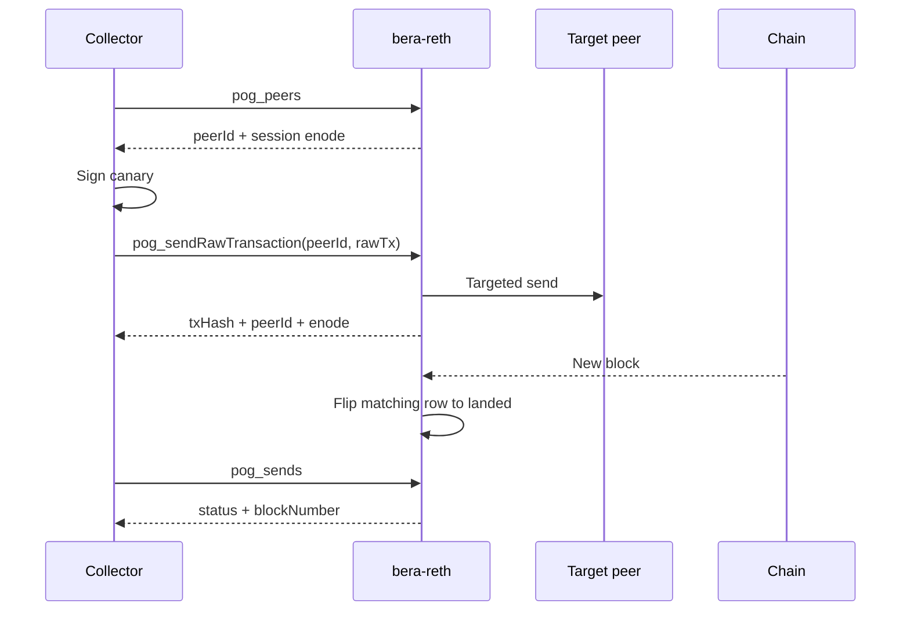

# Sentry-free Proof of Gossip

Proof of Gossip (PoG) proves one thing: the node sent a transaction to exactly one
peer, and that transaction later landed in a block.

The node keeps the smallest surface that only it can provide: the live peer table,
a targeted send, and an in-memory record of what landed. A downstream collector
builds and signs canaries, tracks nonces, and stores history. The node holds no
signing key and no database.

## Audience

Operators running `bera-reth` and developers writing a collector against it.

## Terms

| Term | Meaning |
|---|---|
| Canary | A transaction the collector signs and sends to one peer to test delivery. |
| Collector | The downstream process that signs canaries, calls PoG, and stores results. |
| `peerId` | The peer's stable 64-byte node public key. PoG credits sends to this. |
| Session enode | `enode://peerId@ip:port` built from the live TCP connection. |
| Landing | The canary appearing in a block on the chain. |

## Enable PoG

```bash
bera-reth node --bera.pog
```

The flag installs the `pog` namespace on IPC only. HTTP and WebSocket never expose
it. Without the flag, no `pog_*` method exists and no PoG metric is published.

## How a canary flows



## IPC API

Call the node over its IPC socket, `/tmp/reth.ipc` by default:

```bash
echo '{"jsonrpc":"2.0","id":1,"method":"pog_peers","params":[]}' \
  | nc -U /tmp/reth.ipc
```

### `pog_peers`

Lists connected peers. Takes no parameters.

**Example response**:

```json
{
  "jsonrpc": "2.0",
  "id": 1,
  "result": [
    {
      "peerId": "1c2f...9ab4",
      "enode": "enode://1c2f...9ab4@51.68.187.101:30304",
      "direction": "outbound",
      "client": "reth/v1.11.4"
    }
  ]
}
```

| Field | Type | Description |
|---|---|---|
| `peerId` | string | Stable 64-byte node public key, hex without `0x`. The credit key. |
| `enode` | string | Session enode from the live TCP endpoint. |
| `direction` | string | `inbound` or `outbound`. |
| `client` | string | Peer client version string. |

The session endpoint is the truth for the current connection. A peer advertises a
discovery address that can differ from the address it actually connected on, so
PoG reports the established remote instead.

### `pog_sendRawTransaction`

Sends one signed transaction to one named peer.

| Parameter | Type | Required | Description |
|---|---|---|---|
| `peerId` | string | Yes | Target peer, hex with or without `0x`. |
| `rawTx` | string | Yes | Signed EIP-2718 transaction, hex encoded. |

**Example request**:

```json
{
  "jsonrpc": "2.0",
  "id": 1,
  "method": "pog_sendRawTransaction",
  "params": ["1c2f...9ab4", "0x02f8..."]
}
```

**Example response**:

```json
{
  "jsonrpc": "2.0",
  "id": 1,
  "result": {
    "txHash": "0x9f1c...",
    "peerId": "1c2f...9ab4",
    "enode": "enode://1c2f...9ab4@51.68.187.101:30304"
  }
}
```

**Refusals**: the node recovers the signer before sending and rejects the call in
three cases.

| Message contains | Cause | Resolution |
|---|---|---|
| `syncing` | The node is still syncing. | Wait for `pog_nodeStatus.syncing` to report `false`. |
| `not connected` | The target left the peer set. | Re-read `pog_peers` and pick a live peer. |
| `inflight` | That signer already has an unresolved send. | Wait for the row to land or time out, or sign with another account. |

The node never builds transactions and never reserves nonces. One inflight send per
signer is the concurrency limit; add signer accounts to send in parallel.

### `pog_sends`

Returns the in-memory send window. Takes no parameters.

**Example response**:

```json
{
  "jsonrpc": "2.0",
  "id": 1,
  "result": [
    {
      "txHash": "0x9f1c...",
      "peerId": "1c2f...9ab4",
      "enode": "enode://1c2f...9ab4@51.68.187.101:30304",
      "from": "0xa1b2...",
      "nonce": 41,
      "sentAt": 1757443200,
      "status": "landed",
      "blockNumber": 12903455
    }
  ]
}
```

| Field | Type | Description |
|---|---|---|
| `txHash` | string | Join key between the collector and the node. |
| `peerId` | string | Credited peer. |
| `enode` | string | Session enode captured at send time. |
| `from` | string | Signer recovered from the payload. |
| `nonce` | number | Nonce carried by the signed transaction. |
| `sentAt` | number | Unix seconds at send. |
| `status` | string | `sent`, `landed`, or `timeout`. |
| `blockNumber` | number | Present once the canary lands. |

A watcher on new blocks flips matching hashes to `landed`. A send becomes
`timeout` after 25 seconds, and a later match in a new block still flips it to
`landed`.
Rows drop after 15 minutes. A restart discards unresolved rows, so the collector
owns durable history.

### `pog_nodeStatus`

Returns node readiness and backpressure. Takes no parameters.

| Field | Type | Description |
|---|---|---|
| `syncing` | boolean | Sends are refused while `true`. |
| `headNumber` | number | Head block number. |
| `headHash` | string | Head block hash. |
| `sendsInflight` | number | Rows still in `sent`. |

## Prometheus metrics

Metrics label by subnet, never by peer.

| Series | Labels | Description |
|---|---|---|
| `pog_peers` | `subnet`, `direction` | Connected peers per IPv4 `/24` or IPv6 `/48`. |
| `pog_sends_total` | `subnet`, `result` | Counts of `sent`, `landed`, `timeout`, `refused`. |
| `pog_sends_inflight` | none | Sends awaiting inclusion or timeout. |

Peer IDs and single IP addresses stay off metric labels, which keeps series count
flat as the peer set churns. Join a subnet series to `pog_peers` and `pog_sends`
when you need per-peer attribution.

## Bronze++ sentry

`scripts/pog_sentry.py` is the smallest useful collector: a cron job against one
node. It holds the key. The node does not.

Each run sends **at most one** canary, then exits. A peer is eligible when it is
connected, not on the skip list, and has no completed test in the last **3 days**.
Never-tested peers go first. Timeouts count as a completed test, so a black hole
is not retried for 3 days. Three timeout hashes for the same `peerId` put it on a
local skip list ("banned"). That list does not call Reth reputation.

On start, `sent` rows are reconciled against `pog_sends` and
`eth_getTransactionReceipt` so a killed job does not lose the nonce. Metrics are
written to `$STATE_DIR/metrics.prom` for node_exporter textfile collection:
`pog_sentry_checked_total`, `pog_sentry_first_day`, `pog_sentry_skipped`,
`pog_sentry_last_outcome_info`.

Requires `cast` on `PATH`.

```bash
python3 scripts/pog_sentry.py \
  --ipc /tmp/reth.ipc \
  --key-file /secret/pog.key \
  --state-dir /var/lib/pog-sentry
```

```cron
*/10 * * * * python3 /opt/bera-reth/scripts/pog_sentry.py --ipc /tmp/reth.ipc --key-file /secret/pog.key --state-dir /var/lib/pog-sentry
```

Out of this sentry: `pog_penalize`, first-hear, a second signer, `/24` quotas, more
than one send per tick.

## Claim boundary

PoG supports one claim: the node sent hash `H` to peer `P` alone, and `H` later
appeared in a block.

PoG does not support the claim that `P` relayed `H`, or that `P` announced it
first. Both need transaction provenance, which stock Reth does not record.
